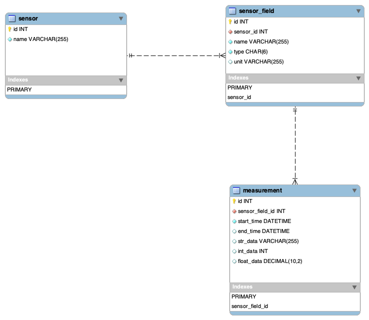
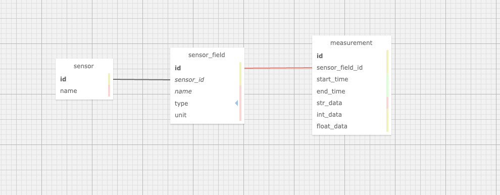

# FIAP - Faculdade de Informática e Administração Paulista

<p align="center">
<a href= "https://www.fiap.com.br/"></a>
</p>

<br>

# Nome do projeto
Cap 1 - Um mapa do tesouro

## Nome do grupo
Guilherme de Castro

## 👨‍🎓 Integrantes: 
- <a href="https://www.linkedin.com/in/guicas/">Guilherme de Castro</a>


## 👩‍🏫 Professores:
### Tutor(a) 
- <a href="https://www.linkedin.com/in/lucas-gomes-moreira-15a8452a/">Lucas Gomes Moreira</a>
### Coordenador(a)
- <a href="https://www.linkedin.com/in/profandregodoi/">André Godoi</a>


## 📜 Descrição

### Explicação do Schema: Sistema de Monitoramento de Agricultura Digital

Este schema foi desenvolvido para atender às necessidades de um sistema de **Agricultura Digital**, capaz de monitorar e armazenar dados coletados por sensores em plantações. O objetivo é otimizar o uso de recursos como água e nutrientes, monitorar as condições do solo e, futuramente, gerar previsões com base em dados históricos. A seguir, explicamos cada componente do banco de dados e como ele atende aos requisitos da atividade.

#### Tabelas e Relacionamentos

##### 1. **Tabela `sensor`**:
   - **Descrição**: Armazena os sensores utilizados na plantação, cada um com um nome que define sua função, como sensores de umidade, medidores de pH, ou sensores de vazão de água.
   - **Principais Colunas**:
     - `id` (INTEGER): Chave primária que identifica cada sensor de forma única.
     - `name` (VARCHAR): Nome descritivo do sensor, como "Sensor de Umidade" ou "Sensor de Irrigação".
   - **Finalidade**: Essa tabela centraliza todos os sensores disponíveis no sistema.

##### 2. **Tabela `sensor_field`**:
   - **Descrição**: Define os diferentes campos de medição de cada sensor. Por exemplo, um sensor de umidade teria um campo "Umidade", enquanto um sensor de irrigação teria um campo "Fluxo de Água".
   - **Principais Colunas**:
     - `id` (INTEGER): Chave primária para identificar cada campo de sensor.
     - `sensor_id` (INTEGER): Chave estrangeira que relaciona este campo a um sensor específico na tabela `sensor`.
     - `name` (VARCHAR): Nome do campo medido, como "Umidade", "pH", ou "Fluxo de Água".
     - `type` (CHAR(6)): Tipo de dado coletado pelo campo, podendo ser inteiro, decimal (float), ou string.
     - `unit` (VARCHAR): Unidade de medida, como "%" para umidade ou "litros" para fluxo de água.
   - **Finalidade**: Esta tabela permite definir quais medições um sensor pode realizar, e cada medição tem uma unidade de medida associada para maior clareza.

##### 3. **Tabela `measurement`**:
   - **Descrição**: Armazena as medições feitas pelos sensores ao longo do tempo, possibilitando a análise histórica das condições da plantação.
   - **Principais Colunas**:
     - `id` (INTEGER): Chave primária para identificar cada medição.
     - `sensor_field_id` (INTEGER): Chave estrangeira que relaciona a medição a um campo de sensor específico na tabela `sensor_field`.
     - `start_time` (DATETIME): Registra o início da medição.
     - `end_time` (DATETIME): Registra o fim da medição, aplicável para sensores que monitoram ao longo do tempo, como irrigação.
     - **`str_data` (VARCHAR)**, **`int_data` (INTEGER)**, **`float_data` (DECIMAL)**: Estes campos flexíveis permitem armazenar diferentes tipos de dados de medição, como valores numéricos, texto ou valores decimais. Por exemplo, a medição de umidade seria armazenada como um valor decimal em `float_data`, enquanto um sensor de pH também armazenaria o valor medido em `float_data`.
   - **Finalidade**: Esta tabela centraliza todas as medições dos sensores ao longo do tempo, permitindo armazenar tanto dados pontuais (como umidade e pH) quanto dados contínuos (como fluxo de água).

#### Relacionamentos

1. **Relacionamento `sensor` 1:N `sensor_field`**:
   - Um sensor pode ter vários campos de medição, mas cada campo pertence a apenas um sensor. Isso reflete o fato de que um único dispositivo (sensor) pode medir diferentes variáveis, como umidade e pH.

2. **Relacionamento `sensor_field` 1:N `measurement`**:
   - Cada campo de sensor pode ter várias medições associadas, mas cada medição pertence a um único campo. Isso permite que o sistema registre medições contínuas ou pontuais de cada campo de um sensor.

#### Funcionalidades do Schema

1. **Medição Direta da Quantidade de Água**:
   - Um dos requisitos da atividade era medir a quantidade de água usada na irrigação. Isso é realizado pelo sensor de irrigação, que tem um campo de medição chamado "Fluxo de Água", armazenando a quantidade de água aplicada em litros diretamente na coluna `float_data`. A coluna `unit` em `sensor_field` define que a unidade de medida é "litros", deixando claro que a medição se refere à quantidade de água.

2. **Monitoramento de Umidade, pH e Nutrientes**:
   - Sensores de umidade, pH, e nutrientes (como NPK) podem ter suas medições armazenadas de forma flexível nas colunas apropriadas (`int_data`, `float_data`, ou `str_data`). Por exemplo, uma medição de umidade seria armazenada em `float_data` com a unidade "%" e o valor seria registrado junto com o `start_time`.

3. **Análise Histórica**:
   - A combinação de `start_time` e `end_time` permite registrar medições ao longo do tempo, tanto para dados contínuos quanto pontuais. Isso facilita a análise histórica de condições de solo, permitindo ajustar o uso de água e nutrientes com base nas necessidades da plantação.

#### Cardinalidade dos campos e tabelas

#### 1. **Tabela `sensor`**
   - **`id`**: 1:1 – Cada sensor tem um identificador único, portanto, a cardinalidade para este atributo é de 1:1 (um sensor para um identificador).
   - **`name`**: 1:1 – Cada sensor tem um nome único que o descreve. Portanto, a cardinalidade é 1:1.

#### 2. **Tabela `sensor_field`**
   - **`id`**: 1:1 – Cada campo de sensor possui um identificador único, logo, a cardinalidade é 1:1.
   - **`sensor_id`**: 1:N – Um sensor pode ter vários campos de medição. Ou seja, um sensor (em `sensor`) pode estar relacionado a muitos campos (`sensor_field`), mas cada campo está vinculado a apenas um sensor. A cardinalidade é 1:N.
   - **`name`**: 1:1 – Cada campo dentro de um sensor tem um nome único, como "Umidade" ou "Fluxo de Água", então a cardinalidade é 1:1.
   - **`type`**: 1:1 – Cada campo de medição tem um tipo específico (int, float, string), sendo a cardinalidade 1:1.
   - **`unit`**: 1:1 – Cada campo de medição tem uma unidade de medida associada, como "litros" ou "%", logo, a cardinalidade também é 1:1.

#### 3. **Tabela `measurement`**
   - **`id`**: 1:1 – Cada medição tem um identificador único, o que significa que a cardinalidade é 1:1.
   - **`sensor_field_id`**: 1:N – Um campo de sensor (em `sensor_field`) pode ter várias medições associadas, mas cada medição pertence a um único campo. A cardinalidade aqui é 1:N (um campo de sensor pode ter muitas medições).
   - **`start_time`**: 1:1 – Cada medição tem um início registrado, então a cardinalidade para o `start_time` é 1:1 (uma medição tem um único horário de início).
   - **`end_time`**: 1:1 – Cada medição contínua tem um fim registrado, portanto, a cardinalidade é 1:1 (uma medição tem um único horário de término, se aplicável).
   - **`str_data`**: 1:1 – Se a medição contiver uma string (por exemplo, se o dado for textual), esse campo armazena a informação. A cardinalidade é 1:1 (uma medição tem um valor textual).
   - **`int_data`**: 1:1 – Caso a medição contenha um número inteiro, ele será armazenado aqui, com a cardinalidade de 1:1.
   - **`float_data`**: 1:1 – Para medições numéricas decimais, como quantidade de água ou porcentagem de umidade, a cardinalidade também é 1:1 (uma medição contém um valor decimal).

#### Relacionamentos Entre as Tabelas

1. **Relacionamento entre `sensor` e `sensor_field`**:
   - **Cardinalidade**: 1:N – Um sensor pode ter vários campos de medição, mas cada campo pertence a apenas um sensor. A cardinalidade é 1:N (um sensor para muitos campos).

2. **Relacionamento entre `sensor_field` e `measurement`**:
   - **Cardinalidade**: 1:N – Um campo de sensor pode ter muitas medições ao longo do tempo, mas cada medição pertence a um único campo de sensor. A cardinalidade aqui é 1:N (um campo de sensor para muitas medições).

#### MER


#### DER


#### Conclusão

Este **schema relacional** foi projetado para atender de forma flexível e escalável às necessidades de um sistema de Agricultura Digital, armazenando medições de sensores em tempo real, permitindo a análise histórica de dados e otimizando a aplicação de recursos. O uso de colunas flexíveis para diferentes tipos de dados e a inclusão de unidades de medida claras asseguram que o sistema possa lidar com diversos tipos de sensores e medições, incluindo a quantidade de água aplicada durante a irrigação.

A análise  de cardinalidade assegura que o banco de dados é estruturado para lidar corretamente com as relações entre sensores, campos de medição e as medições realizadas ao longo do tempo.
- **Tabela `sensor`**: 1 sensor pode ter muitos campos (1:N).
- **Tabela `sensor_field`**: 1 campo de sensor pode ter muitas medições (1:N).
- **Tabela `measurement`**: Cada medição é única e está associada a um campo de sensor e a um período de tempo específico.


---

Essa explicação cobre os principais pontos do schema, deixando claro como ele atende aos requisitos da atividade. Se precisar de mais alguma modificação ou ajuste, é só avisar!

## 📁 Estrutura de pastas

Dentre os arquivos e pastas presentes na raiz do projeto, definem-se:

```
.
├── README.md
├── assets
│   └── logo-fiap.png
├── der-wwsqldesigner.png -- DER imagem
├── der-wwsqldesigner.xml -- DER em xml
├── mer-mwb.png -- MER imagem
```

## 🔧 Como executar o código

Não há executáveis

## 📋 Licença

<p xmlns:cc="http://creativecommons.org/ns#" xmlns:dct="http://purl.org/dc/terms/"><a property="dct:title" rel="cc:attributionURL" href="https://github.com/agodoi/template">MODELO GIT FIAP</a> por <a rel="cc:attributionURL dct:creator" property="cc:attributionName" href="https://fiap.com.br">Fiap</a> está licenciado sobre <a href="http://creativecommons.org/licenses/by/4.0/?ref=chooser-v1" target="_blank" rel="license noopener noreferrer" style="display:inline-block;">Attribution 4.0 International</a>.</p>


